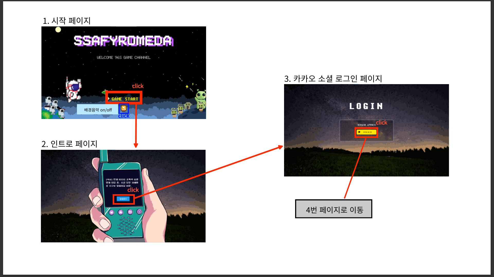
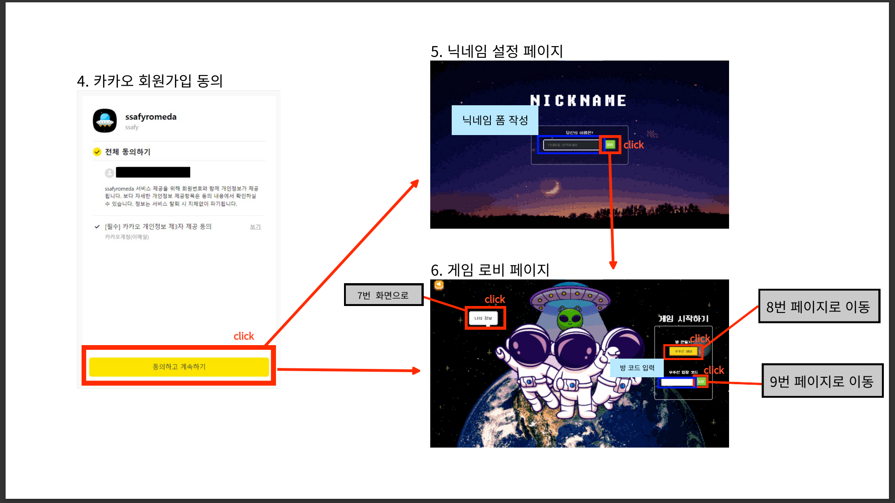
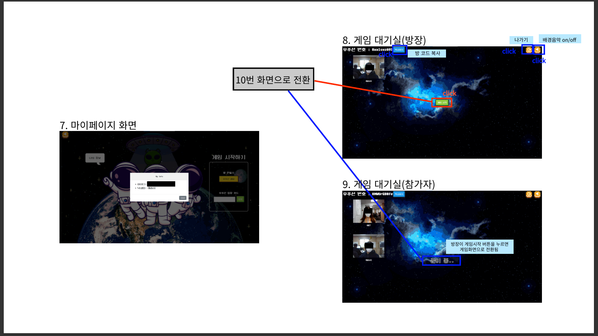
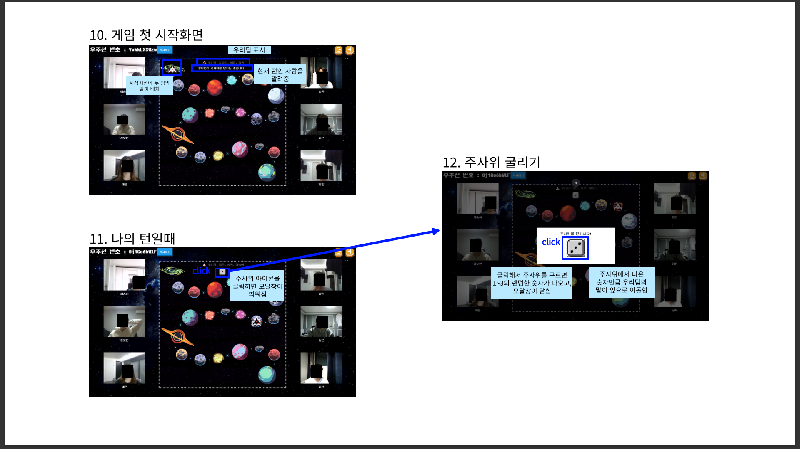
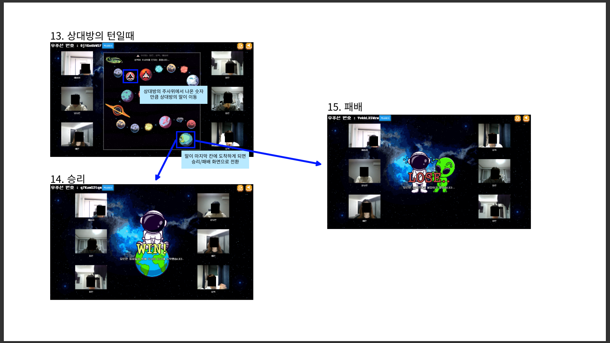

# 🚀SSAFYROMEDA(싸피로메다)🚀

1. [**소개**](#소개)
2. [**개발 기간**](#개발-기간)
3. [**기술 스택**](#기술-스택)
4. [**주요 기능**](#주요-기능)
5. [**프로젝트 구성도**](#프로젝트-구성도)
6. [**개발 팀 소개**](#-팀-소개)
7. [**실행 방법**](#실행-방법)
   
   <br />

## 소개

<a href="http://i8d205.p.ssafy.io"></a>

### 🚀화상으로 즐기는 보드게임, [SSAFYROMEDA](http://i8d205.p.ssafy.io)🚀

- 어릴때는 함께였던 친구들이 각자 취업 및 학업의 이유로 친구들과의 만남이 어려워졌습니다.
- 화상 채팅을 활용한 보드게임을 통해 모임과 오락 모든 요구를 충족시키는 서비스를 제공합니다.
- 단순히 얼굴을 보고 게임을 하는 것이 아니라 화상 채팅 기능을 활용한 미니게임을 제공하여 더욱더 몰입할 수 있게 합니다.
  
  <br />

## 개발 기간

### 🗓️2023.01.03 ~ 2023.02.17 (7주)

<br />

## 기술 스택

### 💻 Front-end

<p align="left">


</p>

### 💻 Back-end

<p align="left">


</p>

### ⭐ Infra Structure

<p align="center">


</p>

### 🗂 Database

<p align="left">

</p>

### 🌐 Network

<p align="left">

</p>
<br />

## 주요 기능





<br />

## 프로젝트 구성도


<br />

## 팀 소개

### 🎲96'S

<table>
  <tr height="80px">
    <td align="center" width="150px">
      
    </td>
    <td align="center" width="150px">
      
    </td>
    <td align="center" width="150px">
      
    </td>
    <td align="center" width="150px">
      <a href="https://github.com/dpdms2148"></a>
    </td>
    <td align="center" width="150px">
      <a href="https://github.com/"></a>
    </td>
    <td align="center" width="150px">
      <a href="https://github.com/cmlee0913"></a>
    </td>
  </tr>
  <tr>
    <td align="center" width="150px">
      <strong>강모현</strong></a><br>Leader | AI
    </td>
    <td align="center" width="150px">
      <strong>박정은</strong></a><br>Frontend | Design
    </td>
    <td align="center" width="150px">
      <strong>이해솜</strong></a><br>Frontend | Design
    </td>
    <td align="center" width="150px">
      <a href="https://github.com/dpdms2148"><strong>장예은</strong></a><br>Backend | Manage
    </td>
    <td align="center" width="150px">
      <strong>김성욱</strong></a><br>Backend | Frontend
    </td>
    <td align="center" width="150px">
      <a href="https://github.com/cmlee0913"><strong>이창민</strong></a><br>CI/CI | Frontend
    </td>
  </tr>
</table>
<br />

## 실행 방법

### client 실행

1. **원격 저장소 복제**

```bash
$ git clone https://lab.ssafy.com/s08-webmobile1-sub2/S08P12D205.git
```

2. **프로젝트 폴더로 이동**

```bash
$ cd frontend
```

3. **필요한 node_modules 설치**

```bash
$ npm install
```

4. **개발 서버 실행**

```bash
$ npm start
```

<br />

### server 실행

1. **원격 저장소 복제**

```bash
$ git clone https://lab.ssafy.com/s08-webmobile1-sub2/S08P12D205.git
```

2. **프로젝트 폴더로 이동**

```bash
$ cd backend
```

3. **main 메서드 실행하기**
